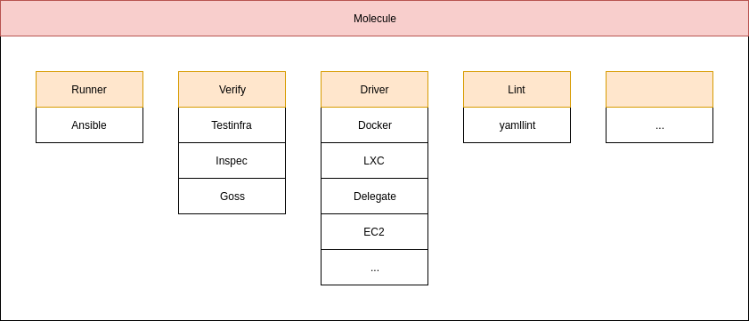

class: title, middle, center

# Testdriven Ansible (Molecule + Testinfra)

---
## Introduction Speaker

### <i class="fas fa-user fa-fw"></i> Daniel Schier
#### <i class="fas fa-birthday-cake fa-fw"></i> Born before the internet
#### <i class="fas fa-home fa-fw"></i> Dresden, Germany
----
#### <i class="fas fa-building fa-fw"></i> profi.com AG - business solutions
#### <i class="fas fa-graduation-cap fa-fw"></i> Watched "IT Crowd"
#### <i class="fas fa-lightbulb fa-fw"></i> Inspired by these cool "Hacker guys" in TV
#### <i class="fas fa-hammer fa-fw"></i> Having fun coding, operating and managing IT
----
#### <i class="fab fa-twitter fa-fw"></i> daniel_wtd
#### <i class="fas fa-envelope fa-fw"></i> daniel@while-true-do.io

---

## Introduction Sponsor

### <i class="fas fa-building fa-fw"></i> profi.com AG - business solutions
#### <i class="fas fa-lightbulb fa-fw"></i> we make IT work
#### <i class="fas fa-home fa-fw"></i> Stresemannplatz 3, 01309 Dresden
----
#### <i class="fas fa-birthday-cake fa-fw"></i> 2000
#### <i class="fas fa-hard-hat fa-fw"></i> 66
#### <i class="fas fa-hammer fa-fw"></i> consulting for cloud, quality, security
----

#### <i class="fas fa-envelope fa-fw"></i> kontakt@proficom.de
#### <i class="fas fa-globe fa-fw"></i> www.proficom.de

---
## <i class="fas fa-table fa-fw"></i> Table of Contents

-   The big picture
-   Setup
-   Writing Tests (Testinfra)
-   Defining Scenario (Molecule)
-   Writing Automation (Ansible)
-   Demo

You can find the content at https://github.com/ansible-community/ansible-dresden-meetup
---
## The big picture
<!-- class: title, middle, center -->


---
## Setup
<!-- class: title, middle, center -->
---
## Setup

You will need your typical Ansible Virtualenv.

```
# Create the env
virtualenv <venv>

# Activate
source <venv>/bin/activate

# Install molecule
pip install ansible molecule[docker]
```
---
## Setup

Create a new role and init molecule

```
# Create new role
ansible-galaxy init <role_name>

# Change directory
cd <role_name>

# Initialize a new molecule scenario
molecule init scenario -r <role_name>

# Run molecule the first time
molecule test
```
---
## Writing Tests (Testinfra)
<!-- class: title, middle, center -->
---
## Writing Tests (Testinfra)

For writing tests, you will need [Testinfra](https://testinfra.readthedocs.io).

> With Testinfra you can write unit tests in Python to test actual state of your servers configured by management tools like Salt, Ansible, Puppet, Chef and so on.

> Testinfra aims to be a Serverspec equivalent in python and is written as a plugin to the powerful Pytest test engine
---
## Writing Tests (Testinfra)

You will find a prepared file, which needs some love.

```
vi molecule/default/tests/test_default.py
```
The content will look like.
```
import os

import testinfra.utils.ansible_runner

testinfra_hosts = testinfra.utils.ansible_runner.AnsibleRunner(
    os.environ['MOLECULE_INVENTORY_FILE']).get_hosts('all')


def test_hosts_file(host):
    f = host.file('/etc/hosts')

    assert f.exists
    assert f.user == 'root'
    assert f.group == 'root'
```
---
## Writing Tests (Testinfra)

Let's assume, we want to have a webserver running (1/2)

```
# molecule/default/tests/test_default.py


import os

import testinfra.utils.ansible_runner

testinfra_hosts = testinfra.utils.ansible_runner.AnsibleRunner(
    os.environ['MOLECULE_INVENTORY_FILE']).get_hosts('all')


def test_httpd_package(host):
    pkg = host.package('httpd')

    assert pkg.is_installed

...snip...
```
---
## Writing Tests (Testinfra)

Let's assume, we want to have a webserver running (2/2)
```
...snap...


def test_httpd_service(host):
    srv = host.service('httpd')

    assert srv.is_running
    assert srv.is_enabled


def test_httpd_socket(host):
    sock = "tcp://80"

    assert sock.is_listening
```
---
## Defining Scenario (Molecule)
<!-- class: title, middle, center -->
---
## Defining Scenario (Molecule)

You can automate the whole testing with [molecule](https://molecule.readthedocs.io).

> Molecule is designed to aid in the development and testing of Ansible roles.

> Molecule provides support for testing with multiple instances, operating systems and distributions, virtualization providers, test frameworks and testing scenarios.

> Molecule encourages an approach that results in consistently developed roles that are well-written, easily understood and maintained.
---
## Defining Scenario (Molecule)

You will need to review the molecule configuration.

```
vi molecule/default/molecule.yml
```
The content will look like:
```
---
dependency:
  name: galaxy
driver:
  name: docker
lint:
  name: yamllint
platforms:
  - name: instance
    image: centos:7

...snip...
```
---
## Defining Scenario (Molecule)

Using systemd needs some tuning.

```
...snip...

platforms:
  - name: centos7
    image: centos:7
    volume_mounts:
      - /sys/fs/cgroup:/sys/fs/cgroup:ro
    tmpfs:
      - /run
      - /tmp
    # privileged: true
    environment:
      container: docker

...snap...
```
---
class: title, middle, center

## Demo

Let's see this in action.
<!-- class: title, middle, center -->

-- $> molecule test

---
## <i class="fas fa-hands-helping fa-fw"></i> Propaganda

#### Ansible

-   [ansible website](https://www.ansible.com)
-   [ansible github](https://github.com/ansible)
-   [ansible community](https://www.ansible.com/community)
-   [ansible community github](https://github.com/ansible-community)
-   [meetup dresden](https://www.meetup.com/de-DE/Ansible-Dresden/)

#### while-true-do.io

-   [wtd website](https://while-true-do.io)
-   [wtd github](https://github.com/while-true-do)
-   [wtd twitter](https://twitter.com/wtd_news)

#### Profi.com AG (Sponsor)

-   [proficom.de](https://www.proficom.de/)
---
class: title, middle, center

## Fin

Thank you so much for participating and please feel free to join us again.
